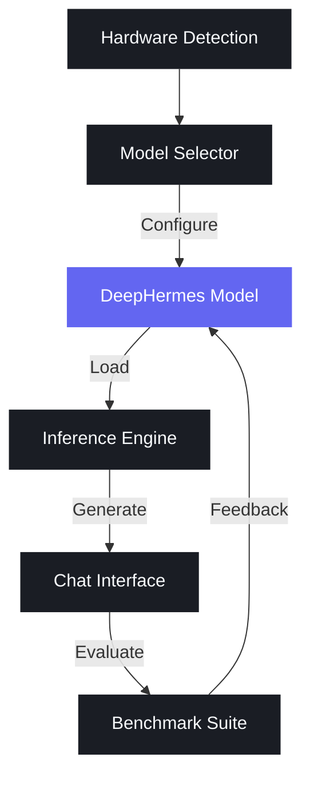
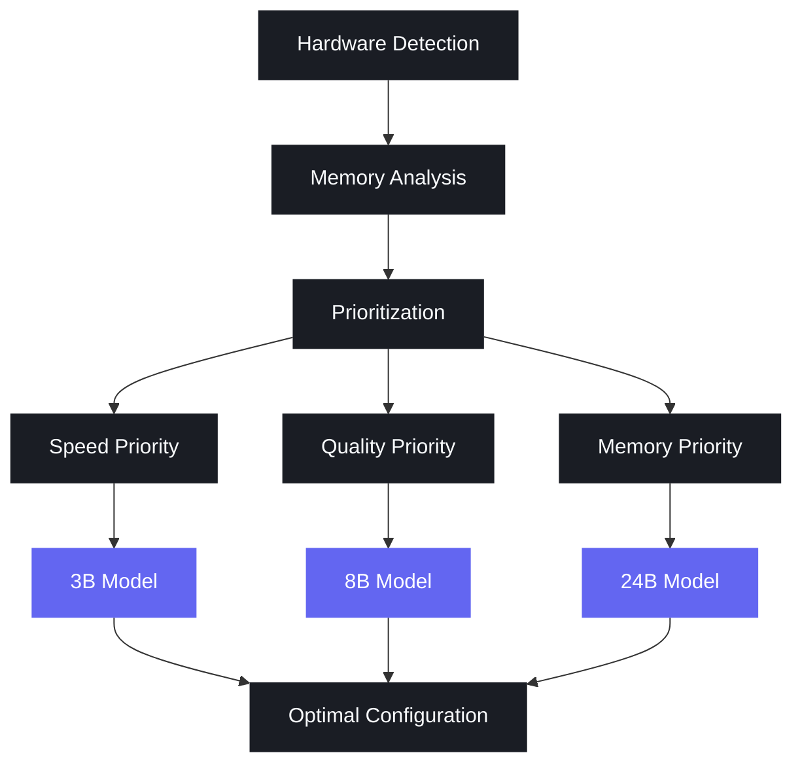
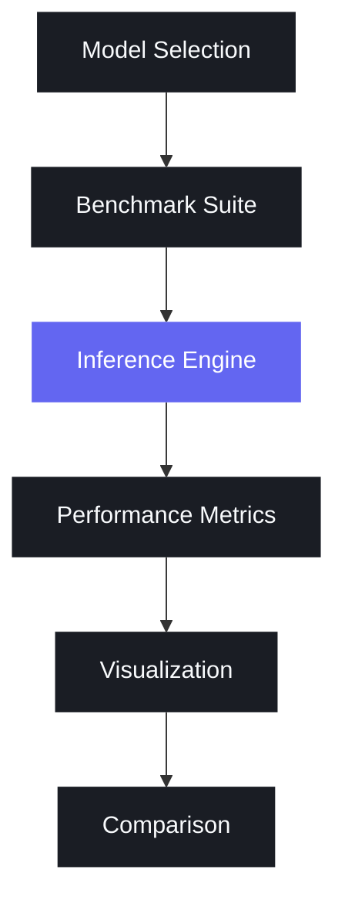

# DeepHermes MLX

<div align="center">
  
</div>

> **Vision**: Can we build a world where AI adapts to your hardware, keeps data private, turns ordinary devices into networked compute clusters, and integrates seamlessly with existing workflows? DeepHermes MLX is a small step toward this vision by providing high-performance local inference for DeepHermes reasoning models.

This repository contains a Python implementation for running inference with DeepHermes models on Apple Silicon using the MLX framework. It supports memory-efficient loading options, enhanced reasoning capabilities, comprehensive benchmarking, and adaptive model selection.

## Overview



### Features

- Run inference with DeepHermes models (3B, 8B, 24B) on Apple Silicon
- Interactive chat mode with history management
- Memory-efficient options (quantization, lazy loading)
- Enhanced reasoning capabilities with DeepHermes's specialized thinking process
- Streaming text generation
- **Multi-Model Benchmark Suite** for evaluating model performance
- **Adaptive Model Selector** for optimal configuration based on hardware

## Quick Start

The fastest way to get started is to use the provided quickstart script:

```bash
# Make the script executable if needed
chmod +x quickstart.sh

# Run the quickstart script
./quickstart.sh
```

This will:
- Set up a virtual environment
- Install dependencies
- Download the DeepHermes model
- Provide instructions for running the model

After running the quickstart script, you'll be ready to use the model immediately without any additional setup.

## Installation

1. Clone this repository:
```bash
git clone https://github.com/jbarnes850/mlx-deephermes.git
cd mlx-deephermes
```

2. Create and activate a virtual environment:
```bash
python -m venv venv
source venv/bin/activate
```

3. Install dependencies:
```bash
pip install -r requirements.txt
```

## Usage

### Interactive Chat

The easiest way to interact with the model is through the chat interface:

```bash
python chat.py
```

With automatic configuration based on your hardware:

```bash
python chat.py --auto-config
```

With memory optimization options:

```bash
python chat.py --quantize 4bit --lazy-load
```

With enhanced reasoning capabilities:

```bash
python chat.py --reasoning
```

### Single Prompt Inference

For single prompt inference, use the main script:

```bash
python main.py --prompt "Explain quantum computing in simple terms."
```

With memory optimization and reasoning:

```bash
python main.py --prompt "Explain quantum computing in simple terms." --quantize 4bit --reasoning
```

## Command Line Options

### Model Options
- `--model`: Model path or Hugging Face repo ID (default: "mlx-community/DeepHermes-3-Llama-3-8B-Preview-bf16")
- `--trust-remote-code`: Trust remote code in tokenizer
- `--auto-config`: Automatically configure model based on hardware capabilities

### Generation Options
- `--prompt`: Text prompt for generation
- `--system-prompt`: System prompt to use (default: "You are DeepHermes, a helpful AI assistant.")
- `--max-tokens`: Maximum number of tokens to generate (default: 1024)
- `--no-stream`: Disable streaming output
- `--max-kv-size`: Maximum KV cache size for long context

### Reasoning Options
- `--reasoning`: Enable DeepHermes reasoning mode
- `--reasoning-depth`: Set reasoning depth (choices: "basic", "deep", "expert", default: "deep")

### Memory Optimization Options
- `--quantize`: Quantize model to reduce memory usage (choices: "4bit", "8bit")
- `--lazy-load`: Load model weights lazily to reduce memory usage

## Chat Commands

During an interactive chat session, you can use the following commands:

- `exit`: Quit the chat session
- `clear`: Clear chat history
- `system <prompt>`: Change the system prompt
- `reasoning <on|off>`: Toggle reasoning mode on or off
- `help`: Show available commands
- `benchmark [options]`: Run benchmark with optional custom settings
- `recommend`: Get model recommendations based on your hardware
- `switch <model>`: Switch to a different model (e.g., `switch 3b`, `switch 8b`, `switch 24b`)

## Model Selector with Adaptive Loading



### Features

- Hardware detection optimized for Apple Silicon
- Intelligent model recommendations based on available memory and processing power
- Automatic quantization selection
- Seamless model switching during chat sessions
- Prioritization options for speed, quality, or memory efficiency

### Usage

```bash
# Get model recommendations
python -m deephermes.model_selector.cli

# Save recommendations to a config file
python -m deephermes.model_selector.cli --save-config

# Prioritize specific aspects (speed, quality, memory)
python -m deephermes.model_selector.cli --prioritize speed
python -m deephermes.model_selector.cli --prioritize quality
python -m deephermes.model_selector.cli --prioritize memory

# Force a specific model size regardless of hardware
python -m deephermes.model_selector.cli --force-model-size 24B
```

### Integration with Chat Interface

You can use the model selector directly with the chat interface:

```bash
# Automatically configure model based on hardware
python chat.py --auto-config

# Automatically configure with priority on quality
python chat.py --auto-config --prioritize quality
```

### In-Chat Commands

During a chat session, you can use these commands to interact with the model selector:

- `recommend`: Get model recommendations based on your hardware
- `recommend speed`: Get recommendations prioritizing inference speed
- `recommend quality`: Get recommendations prioritizing reasoning quality
- `recommend memory`: Get recommendations prioritizing memory efficiency
- `switch 3b`: Switch to the 3B model with optimal configuration
- `switch 8b`: Switch to the 8B model with optimal configuration
- `switch 24b`: Switch to the 24B model with optimal configuration
- `switch 3b 4bit`: Switch to the 3B model with 4-bit quantization
- `switch 8b 8bit`: Switch to the 8B model with 8-bit quantization

### Hardware Detection

The model selector detects the following hardware information:

- Device name and chip type
- Available memory
- CPU cores and architecture
- GPU cores (for Apple Silicon)
- Neural Engine cores (for Apple Silicon)

Based on this information, it recommends the optimal model configuration that balances:

- Reasoning quality: Larger models generally provide better reasoning
- Inference speed: Smaller models and less quantization are faster
- Memory efficiency: Quantization and lazy loading reduce memory usage

### Configuration Options

The model selector can recommend various configurations:

- **Model Size**: 3B, 8B, or 24B parameter models
- **Quantization**: None (full precision), 8-bit, or 4-bit
- **Lazy Loading**: Enable or disable lazy loading of model weights
- **Max Tokens**: Recommended context length based on available memory

### Example Recommendations

| System Type | Memory | Recommended Model | Quantization | Lazy Loading |
|-------------|--------|-------------------|--------------|--------------|
| High-end    | 32+ GB | DeepHermes-24B     | None/8-bit    | Optional     |
| Mid-range   | 16 GB  | DeepHermes-8B      | None/8-bit    | Optional     |
| Entry-level | 8 GB   | DeepHermes-3B      | 8-bit/4-bit   | Recommended  |

### Programmatic Usage

You can also use the model selector programmatically in your own code:

```python
from deephermes.model_selector.hardware_detection import get_hardware_info
from deephermes.model_selector.model_recommender import recommend_model
from deephermes.model_selector.integration import get_optimal_configuration

# Get hardware information
hardware_info = get_hardware_info()

# Get model recommendation
recommendation = recommend_model(hardware_info)

# Get optimal configuration as a dictionary
config = get_optimal_configuration()

print(f"Recommended model: {config['model']}")
print(f"Quantization: {config['quantize']}")
print(f"Lazy loading: {config['lazy_load']}")
```

## Multi-Model Benchmark Suite



### Features

- Benchmark multiple models (3B, 8B, 24B) in a single run
- Evaluate on standard datasets (MMLU, GSM8K)
- Measure accuracy, inference speed, memory usage, and reasoning quality
- Generate visualizations for easy comparison

### Usage

```bash
# Run benchmark with default settings
python benchmarks/run_benchmark.py

# Benchmark specific models
python benchmarks/run_benchmark.py --models mlx-community/DeepHermes-3-Llama-3-3B-Preview-bf16 mlx-community/DeepHermes-3-Llama-3-8B-Preview-bf16

# Benchmark on specific datasets
python benchmarks/run_benchmark.py --datasets mmlu

# Limit number of samples for faster testing
python benchmarks/run_benchmark.py --num-samples 10

# Specify output directory
python benchmarks/run_benchmark.py --output-dir my_benchmark_results
```

### In-Chat Benchmarking

You can also run benchmarks directly from the chat interface:

```
benchmark
```

## Performance Comparison

| Model | MMLU Score (%) | Tokens/sec | Memory (GB) |
|-------|---------------|------------|-------------|
| DeepHermes-3B | 58.2 | 35.7 | 6 |
| DeepHermes-8B | 67.5 | 22.3 | 16 |
| DeepHermes-24B | 76.8 | 9.1 | 48 |

## Contributing

Contributions are welcome! Please feel free to submit a Pull Request.

## License

This project is licensed under the MIT License - see the LICENSE file for details.

## Acknowledgements

- [MLX Framework](https://github.com/ml-explore/mlx) by Apple
- [DeepHermes](https://huggingface.co/collections/nous-research/deephermes-65d9b6f4a3b3d9c2f8c0ae9f) by Nous Research
- [Hugging Face](https://huggingface.co/) for model hosting
