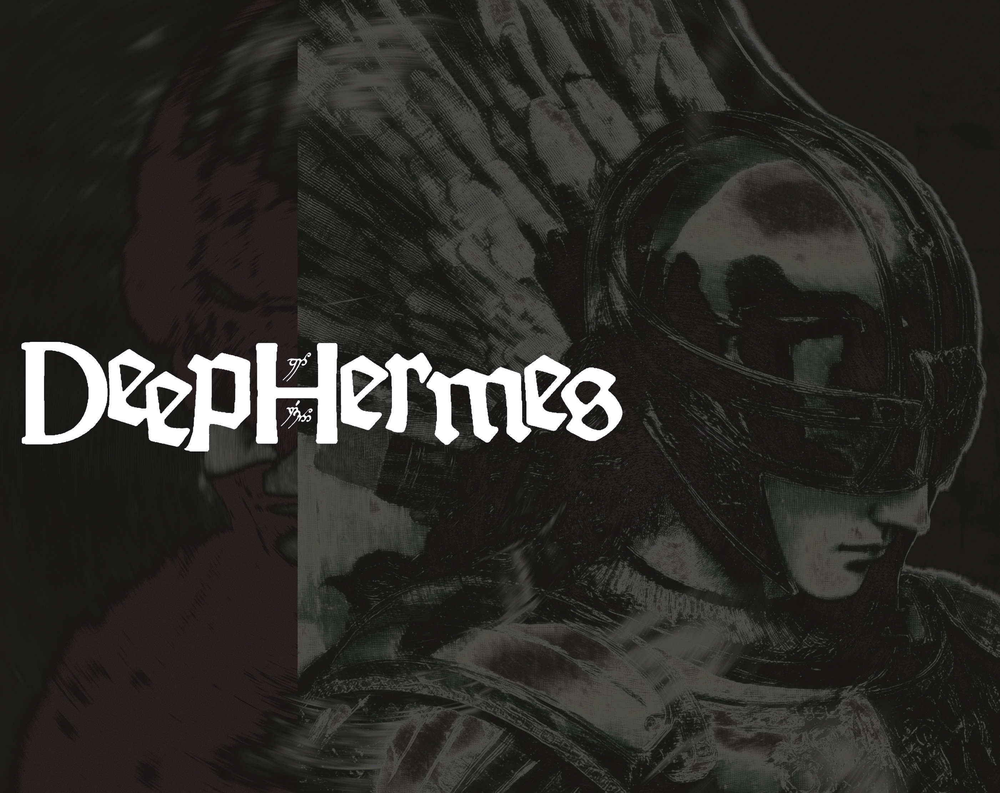
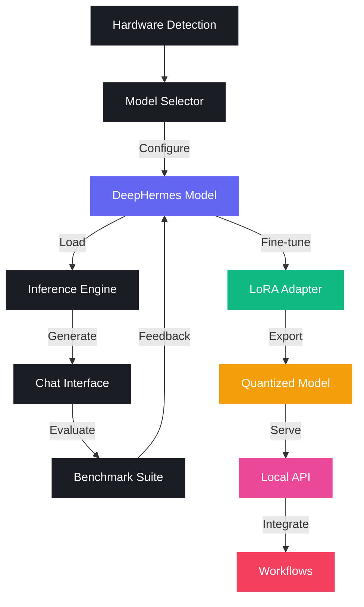
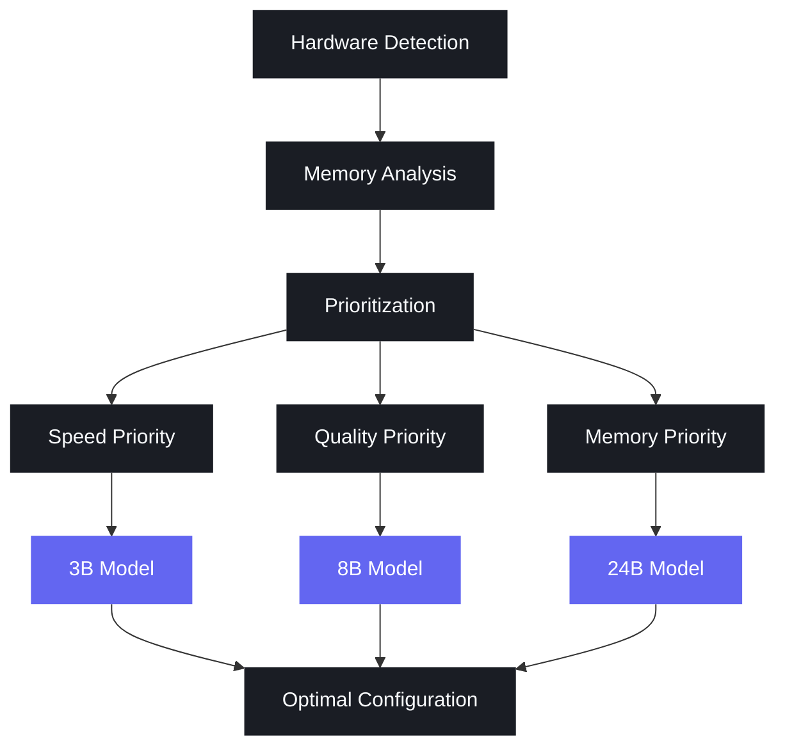
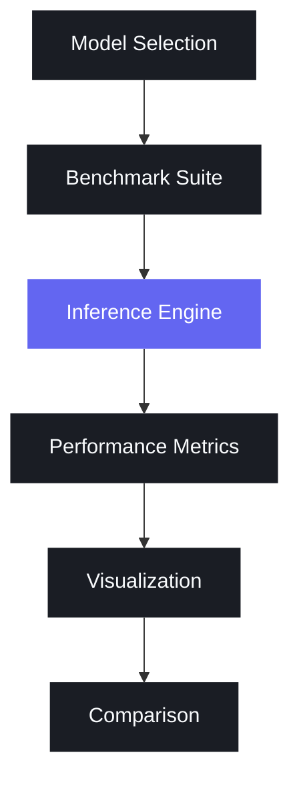

# DeepHermes MLX

<div align="center">
  
</div>

> **Vision**: Can we build a world where AI adapts to your hardware, keeps data private, turns ordinary devices into networked compute clusters, and integrates seamlessly with existing workflows?

### The Adaptive ML Workflow

We believe that the **Adaptive ML Workflow** is a dynamic approach that intelligently configures every aspect of the ML pipeline based on your specific hardware capabilities. DeepHermes MLX understands your hardware and builds workflows optimized for you.

## End-to-End Workflow

1. **Model Selector** - Optimized selection of a DeepHermes model based on your hardware
2. **Inference** - Run inference with DeepHermes models
3. **Fine-tune** - Customize models on your data using efficient LoRA fine-tuning
4. **Export** - Optimize models with quantization for deployment
5. **Serve** - Deploy models locally with an OpenAI-compatible API
6. **Integrate** - Connect with applications and frameworks

## Overview



### Features

- Run inference with DeepHermes models (3B, 8B, 24B) on Apple Silicon
- Interactive chat mode with history management
- Memory-efficient options (quantization, lazy loading)
- Enhanced reasoning capabilities with DeepHermes's specialized thinking process
- Streaming text generation
- **LoRA Fine-tuning** for customizing models on your own data
- **Model Export & Quantization** for optimized deployment
- **Local Model Serving** via API endpoints
- **Multi-Model Benchmark Suite** for evaluating model performance
- **Adaptive Model Selector** for optimal configuration based on hardware

## Quick Start

The fastest way to get started is to use the provided quickstart script:

```bash
# Make the script executable if needed
chmod +x quickstart.sh

# Run the quickstart script
./quickstart.sh
```

This will:
- Set up a virtual environment
- Install dependencies
- Download the DeepHermes model
- Provide instructions for running the model

## Fine-tuning

DeepHermes MLX supports efficient fine-tuning of models on Apple Silicon using Low-Rank Adaptation (LoRA). This allows you to customize models on your own data while maintaining performance.

### Fine-tuning Workflow

```bash
# Prepare data and run fine-tuning (using Hugging Face dataset)
./scripts/finetune_mlx.sh --model "mlx-community/DeepHermes-3-Llama-3-8B-Preview-bf16" \
  --dataset-name "tatsu-lab/alpaca" \
  --num-examples 100 \
  --prepare-data --train

# Generate text with the fine-tuned model
./scripts/finetune_mlx.sh --model "mlx-community/DeepHermes-3-Llama-3-8B-Preview-bf16" \
  --prompt "Explain the concept of reinforcement learning" \
  --generate
```

### Key Features

- **Efficient LoRA Fine-tuning**: Updates only a small fraction of model parameters
- **HuggingFace Dataset Integration**: Easily use datasets from the HuggingFace Hub
- **Modular Workflow**: Prepare data, train, evaluate, and generate text in separate steps
- **Apple Silicon Optimization**: Designed for high performance on M-series chips

## Model Serving

DeepHermes MLX includes a serve module that allows you to deploy your models with an OpenAI-compatible API server. This enables seamless integration with existing tools and applications that support the OpenAI API.

### Serving Workflow

```bash
# Start the server with a model
./scripts/serve_model.sh start --model /path/to/exported/model

# Check server status
./scripts/serve_model.sh status

# Test the server with a prompt
./scripts/serve_model.sh test --prompt "Explain quantum computing in simple terms"

# Stop the server
./scripts/serve_model.sh stop
```

### Key Features

- **OpenAI API Compatibility**: Drop-in replacement for OpenAI API clients
- **Local Deployment**: Keep your data private by running everything locally
- **Streaming Support**: Real-time text generation with streaming responses
- **Configuration Options**: Customize host, port, and model parameters
- **MLX Optimization**: Leverages MLX for high-performance inference on Apple Silicon

### API Endpoints

The server provides the following OpenAI-compatible endpoints:

- `/v1/models`: List available models
- `/v1/completions`: Generate text completions
- `/v1/chat/completions`: Generate chat completions
- `/v1/embeddings`: Generate embeddings (if supported by the model)

## LangChain Integration

DeepHermes MLX provides seamless integration with LangChain, allowing you to use your DeepHermes models with LangChain's ecosystem of tools and frameworks for building LLM-powered applications.

### Getting Started

There are two ways to use the LangChain integration:

1. **Start a new server with a model**:
   ```bash
   # Start a new server with a model and launch the example
   ./scripts/quickstart.sh --langchain --model mlx-community/DeepHermes-3-Llama-3-8B-Preview-bf16
   ```

2. **Connect to an existing server**:
   ```bash
   # First start the MLX-LM server
   venv/bin/mlx_lm.server --model mlx-community/Phi-3-mini-4k-instruct-4bit --host 127.0.0.1 --port 8080
   
   # In a separate terminal, run the LangChain example
   venv/bin/python examples/langchain_example.py --host 127.0.0.1 --port 8080 --example llm
   ```

### Example Modes

The LangChain integration supports three main usage modes:

1. **LLM Mode** - Basic text generation:
   ```bash
   venv/bin/python examples/langchain_example.py --host 127.0.0.1 --port 8080 --example llm
   ```

2. **Chat Mode** - Interactive chat with message history:
   ```bash
   venv/bin/python examples/langchain_example.py --host 127.0.0.1 --port 8080 --example chat
   ```

3. **Chain Mode** - Composable LangChain chains:
   ```bash
   venv/bin/python examples/langchain_example.py --host 127.0.0.1 --port 8080 --example chain
   ```

### Key Features

- **LLM Integration**: Use DeepHermes models with LangChain's LLM interfaces
- **Chat Model Support**: Interact with DeepHermes models using LangChain's chat interfaces
- **Streaming Support**: Stream responses for real-time feedback
- **Server Management**: Automatically start and manage the MLX-LM server
- **CLI Interface**: Simple command-line interface for common use cases
- **Compatible with Multiple Models**: Works with any model supported by MLX-LM server

### Programmatic Usage

```python
# Using DeepHermes as a LangChain LLM
from deephermes.integrate.langchain import DeepHermesLLM
from langchain_core.prompts import PromptTemplate
from langchain_core.output_parsers import StrOutputParser

# Connect to an existing server
llm = DeepHermesLLM(host="127.0.0.1", port=8080)

# Or start a new server with a model
llm = DeepHermesLLM(
    model_path="/path/to/model",
    start_server=True,
    temperature=0.7,
    max_tokens=512
)

# Create a simple chain
template = """
You are an expert in {topic}.

Explain the following concept in simple terms: {concept}

Your explanation should be:
- Clear and concise
- Understandable by a beginner
- Include 3 key points
"""

prompt = PromptTemplate.from_template(template)
chain = prompt | llm | StrOutputParser()

# Run the chain
result = chain.invoke({
    "topic": "quantum physics",
    "concept": "wave-particle duality"
})
print(result)

# Using DeepHermes as a LangChain Chat Model
from deephermes.integrate.langchain import ChatDeepHermes
from langchain_core.messages import HumanMessage, SystemMessage

# Create a chat model
chat = ChatDeepHermes(
    host="127.0.0.1", 
    port=8080
)

# Create messages
messages = [
    SystemMessage(content="You are a helpful assistant specialized in quantum physics."),
    HumanMessage(content="Explain quantum entanglement in simple terms.")
]

# Get a response
response = chat.invoke(messages)
print(response.content)

### Troubleshooting

If you encounter issues with the LangChain integration, try these steps:

1. **Check server status**: Ensure the MLX-LM server is running and accessible
   ```bash
   curl http://127.0.0.1:8080/v1/models
   ```

2. **Verify model availability**: Make sure the model is properly loaded
   ```bash
   curl http://127.0.0.1:8080/status
   ```

3. **Start server manually**: If automatic server start fails, start it manually
   ```bash
   venv/bin/mlx_lm.server --model <model_name> --host 127.0.0.1 --port 8080
   ```

4. **Check model compatibility**: Not all models work with all features. Try using a different model if you encounter issues.

### Advanced Usage

The LangChain integration supports all the features of the MLX-LM server, including:

- **Adapter Support**: Use fine-tuned adapters with your base model
- **Quantization**: Use quantized models for faster inference
- **Custom Chat Templates**: Use custom chat templates for specialized models
- **Memory-Efficient Inference**: Configure cache limits for memory-constrained environments

```python
# Advanced configuration
from deephermes.integrate.langchain import DeepHermesLLM

llm = DeepHermesLLM(
    model_path="/path/to/base/model",
    adapter_path="/path/to/adapter",
    cache_limit_gb=4,
    start_server=True,
    temperature=0.7
)
```

## Installation

1. Clone this repository:
```bash
git clone https://github.com/jbarnes850/mlx-deephermes.git
cd mlx-deephermes
```

2. Create and activate a virtual environment:
```bash
python -m venv venv
source venv/bin/activate
```

3. Install dependencies:
```bash
pip install -r requirements.txt
```

## Usage

### Interactive Chat

The easiest way to interact with the model is through the chat interface:

```bash
python chat.py
```

With automatic configuration based on your hardware:

```bash
python chat.py --auto-config
```

With memory optimization options:

```bash
python chat.py --quantize 4bit --lazy-load
```

With enhanced reasoning capabilities:

```bash
python chat.py --reasoning
```

### Single Prompt Inference

For single prompt inference, use the main script:

```bash
python main.py --prompt "Explain quantum computing in simple terms."
```

With memory optimization and reasoning:

```bash
python main.py --prompt "Explain quantum computing in simple terms." --quantize 4bit --reasoning
```

## Command Line Options

### Model Options
- `--model`: Model path or Hugging Face repo ID (default: "mlx-community/DeepHermes-3-Llama-3-8B-Preview-bf16")
- `--trust-remote-code`: Trust remote code in tokenizer
- `--auto-config`: Automatically configure model based on hardware capabilities

### Generation Options
- `--prompt`: Text prompt for generation
- `--system-prompt`: System prompt to use (default: "You are DeepHermes, a helpful AI assistant.")
- `--max-tokens`: Maximum number of tokens to generate (default: 1024)
- `--no-stream`: Disable streaming output
- `--max-kv-size`: Maximum KV cache size for long context

### Reasoning Options
- `--reasoning`: Enable DeepHermes reasoning mode
- `--reasoning-depth`: Set reasoning depth (choices: "basic", "deep", "expert", default: "deep")

### Memory Optimization Options
- `--quantize`: Quantize model to reduce memory usage (choices: "4bit", "8bit")
- `--lazy-load`: Load model weights lazily to reduce memory usage

## Chat Commands

During an interactive chat session, you can use the following commands:

- `exit`: Quit the chat session
- `clear`: Clear chat history
- `system <prompt>`: Change the system prompt
- `reasoning <on|off>`: Toggle reasoning mode on or off
- `help`: Show available commands
- `benchmark [options]`: Run benchmark with optional custom settings
- `recommend`: Get model recommendations based on your hardware
- `switch <model>`: Switch to a different model (e.g., `switch 3b`, `switch 8b`, `switch 24b`)
- `serve start`: Start a model server with the current model
- `serve status`: Check the status of the running server
- `serve stop`: Stop the running server

## Model Selector with Adaptive Loading



### Features

- Hardware detection optimized for Apple Silicon
- Intelligent model recommendations based on available memory and processing power
- Automatic quantization selection
- Seamless model switching during chat sessions
- Prioritization options for speed, quality, or memory efficiency

### Usage

```bash
# Get model recommendations
python -m deephermes.model_selector.cli

# Save recommendations to a config file
python -m deephermes.model_selector.cli --save-config

# Prioritize specific aspects (speed, quality, memory)
python -m deephermes.model_selector.cli --prioritize speed
python -m deephermes.model_selector.cli --prioritize quality
python -m deephermes.model_selector.cli --prioritize memory

# Force a specific model size regardless of hardware
python -m deephermes.model_selector.cli --force-model-size 24B
```

### Integration with Chat Interface

You can use the model selector directly with the chat interface:

```bash
# Automatically configure model based on hardware
python chat.py --auto-config

# Automatically configure with priority on quality
python chat.py --auto-config --prioritize quality
```

### In-Chat Commands

During a chat session, you can use these commands to interact with the model selector:

- `recommend`: Get model recommendations based on your hardware
- `recommend speed`: Get recommendations prioritizing inference speed
- `recommend quality`: Get recommendations prioritizing reasoning quality
- `recommend memory`: Get recommendations prioritizing memory efficiency
- `switch 3b`: Switch to the 3B model with optimal configuration
- `switch 8b`: Switch to the 8B model with optimal configuration
- `switch 24b`: Switch to the 24B model with optimal configuration
- `switch 3b 4bit`: Switch to the 3B model with 4-bit quantization
- `switch 8b 8bit`: Switch to the 8B model with 8-bit quantization

### Hardware Detection

The model selector detects the following hardware information:

- Device name and chip type
- Available memory
- CPU cores and architecture
- GPU cores (for Apple Silicon)
- Neural Engine cores (for Apple Silicon)

Based on this information, it recommends the optimal model configuration that balances:

- Reasoning quality: Larger models generally provide better reasoning
- Inference speed: Smaller models and less quantization are faster
- Memory efficiency: Quantization and lazy loading reduce memory usage

### Configuration Options

The model selector can recommend various configurations:

- **Model Size**: 3B, 8B, or 24B parameter models
- **Quantization**: None (full precision), 8-bit, or 4-bit
- **Lazy Loading**: Enable or disable lazy loading of model weights
- **Max Tokens**: Recommended context length based on available memory

### Example Recommendations

| System Type | Memory | Recommended Model | Quantization | Lazy Loading |
|-------------|--------|-------------------|--------------|--------------|
| High-end    | 32+ GB | DeepHermes-24B     | None/8-bit    | Optional     |
| Mid-range   | 16 GB  | DeepHermes-8B      | None/8-bit    | Optional     |
| Entry-level | 8 GB   | DeepHermes-3B      | 8-bit/4-bit   | Recommended  |

### Programmatic Usage

You can also use the model selector programmatically in your own code:

```python
from deephermes.model_selector.hardware_detection import get_hardware_info
from deephermes.model_selector.model_recommender import recommend_model
from deephermes.model_selector.integration import get_optimal_configuration

# Get hardware information
hardware_info = get_hardware_info()

# Get model recommendation
recommendation = recommend_model(hardware_info)

# Get optimal configuration as a dictionary
config = get_optimal_configuration()

print(f"Recommended model: {config['model']}")
print(f"Quantization: {config['quantize']}")
print(f"Lazy loading: {config['lazy_load']}")
```

## Model Compatibility

DeepHermes MLX is compatible with a wide range of MLX models, including:

- DeepHermes models (3B, 8B, 24B)
- Mistral models (7B, 24B)
- Llama models (2 and 3 series)
- Gemma models
- And many more

### Adding Custom Compatible Models

If you want to use a model that's not in our pre-defined compatibility list, you can add it in two ways:

1. **Environment Variable**:
   ```bash
   # Add multiple models separated by commas
   export MLX_COMPATIBLE_MODELS="org/model-name-1,org/model-name-2"
   ```

2. **Configuration File**:
   Create a file at `~/.config/deephermes/compatible_models.txt` with one model per line:
   ```
   # My custom MLX-compatible models
   org/model-name-1
   org/model-name-2
   ```

This is particularly useful as new MLX models are released frequently.

## Multi-Model Benchmark Suite



### Features

- Benchmark multiple models (3B, 8B, 24B) in a single run
- Evaluate on standard datasets (MMLU, GSM8K)
- Measure accuracy, inference speed, memory usage, and reasoning quality
- Generate visualizations for easy comparison

### Usage

```bash
# Run benchmark with default settings
python benchmarks/run_benchmark.py

# Benchmark specific models
python benchmarks/run_benchmark.py --models mlx-community/DeepHermes-3-Llama-3-3B-Preview-bf16 mlx-community/DeepHermes-3-Llama-3-8B-Preview-bf16

# Benchmark on specific datasets
python benchmarks/run_benchmark.py --datasets mmlu

# Limit number of samples for faster testing
python benchmarks/run_benchmark.py --num-samples 10

# Specify output directory
python benchmarks/run_benchmark.py --output-dir my_benchmark_results
```

### In-Chat Benchmarking

You can also run benchmarks directly from the chat interface:

```
benchmark
```

## Performance Comparison

| Model | MMLU Score (%) | Tokens/sec | Memory (GB) |
|-------|---------------|------------|-------------|
| DeepHermes-3B | 58.2 | 35.7 | 6 |
| DeepHermes-8B | 67.5 | 22.3 | 16 |
| DeepHermes-24B | 76.8 | 9.1 | 48 |

## Model Export & Deployment

DeepHermes MLX supports exporting and deploying fine-tuned models for production use.

### Exporting Models

Export your fine-tuned model with optional quantization for optimized deployment:

```bash
./scripts/export_model.sh --model ./fine_tuned_model --quantize int8
```

Options:
- `--model`: Path to model or adapter weights
- `--base-model`: Path to base model (required when using adapters)
- `--output`: Output directory (default: ./exported_model)
- `--quantize`: Quantization precision (int8, int4, fp16, none)
- `--format`: Output format (mlx, gguf)
- `--validate`: Validate the exported model

Example with adapter:
```bash
./scripts/export_model.sh \
  --model ./adapters \
  --base-model mlx-community/DeepHermes-3-Llama-3-8B-Preview-bf16 \
  --quantize int8 \
  --validate
```

Quantization reduces model size and improves inference speed:
- **INT8**: Balanced performance and quality (4x smaller)
- **INT4**: Fastest, smallest size (8x smaller)
- **FP16**: Highest quality (2x smaller than FP32)

### Programmatic Usage

```python
from deephermes.export import quantize_model, save_quantized_model
from deephermes.core.model import load_model

# Load model
model = load_model("./fine_tuned_model")

# Quantize model
quantized_model = quantize_model(model, precision="int8")

# Save quantized model
save_quantized_model(quantized_model, "./exported_model")
```

## Contributing

Contributions are welcome! Please feel free to submit a Pull Request.

## License

This project is licensed under the MIT License - see the LICENSE file for details.

## Acknowledgements

- [MLX Framework](https://github.com/ml-explore/mlx) by Apple
- [DeepHermes](https://huggingface.co/collections/nous-research/deephermes-65d9b6f4a3b3d9c2f8c0ae9f) by Nous Research
- [Hugging Face](https://huggingface.co/) for model hosting
